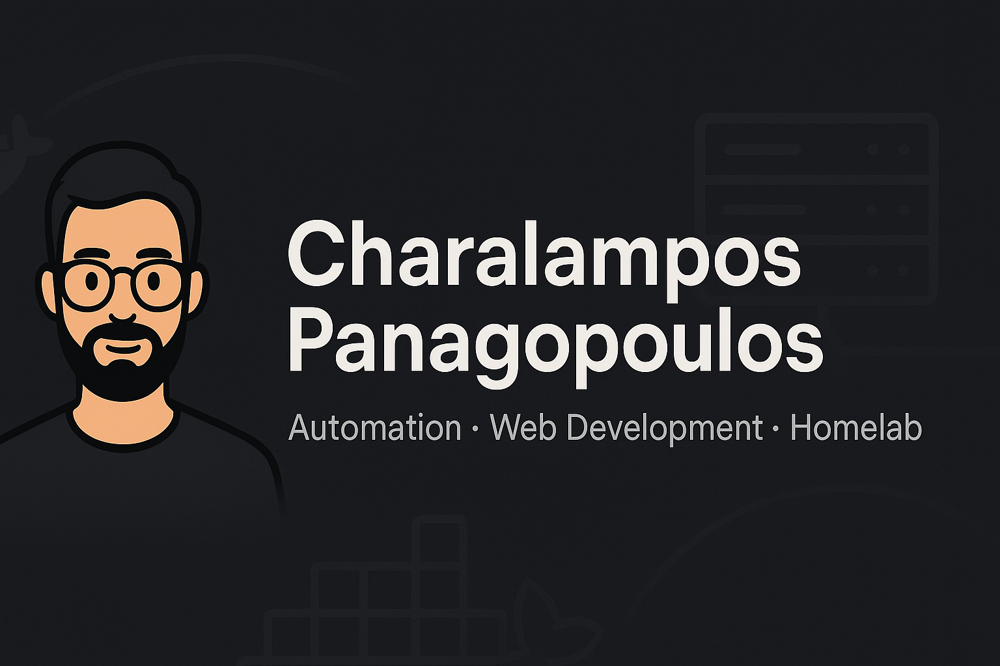

  

# 👋 Hi, I'm Charalampos Panagopoulos

Aspiring Web Developer transitioning from theology and customer service into tech.  
I’m building strong front-end foundations, automating real problems with n8n, and running my own self-hosted homelab — all while working full-time in Greece.

I love solving problems with technology, creating structure in my learning, and building tools that make everyday life easier.

---

## 🧠 Currently Learning

- HTML, CSS, Flexbox, CSS Grid, Bootstrap  
- JavaScript Fundamentals (in progress)  
- Front-end best practices & responsive design  

---

## 🛠️ What I’m Building

### **Self-Hosted Homelab (Linux, Docker, Tailscale)**
My personal infrastructure for development, automation, and learning:
- Dockerized services (Jellyfin, Nextcloud, Vaultwarden, etc.)
- Automated remote access using Tailscale
- Optimized workflows for study and productivity

### **n8n Automation Projects**
- 📚 **Image-to-Notes Learning System** (Nextcloud + OpenAI Vision)  
  Converts handwritten notes into structured digital cards  
- 🗓️ **AI-Powered Daily Scheduler** *(in development)*  
- ⚙️ Custom routines, productivity tools, and quality-of-life automations  

### **Front-End Projects**
- Personal portfolio website (HTML/CSS/Javascript only for now — growing over time)  
- Small practice projects to sharpen JavaScript and layout skills  

---

## 🚀 What Drives Me

Technology helps me solve my own problems:
- When I needed structure while studying, I built automations.  
- When I wanted more control, I built and managed my homelab.  
- When the manual work became too much, I designed workflows to remove it.

This mindset keeps me learning, improving, and building every day.

---

## 🧰 Tech Stack

**Languages & Tools:**  
HTML • CSS • Bootstrap • JavaScript (in progress)

**Automation & Infrastructure:**  
n8n • OpenAI API • Nextcloud • Deck • Docker • Linux • Tailscale

**Other:**  
Markdown • Git • GitHub • WebDAV • API integration

---

## 📌 Featured Projects

### 🔹 [AI-Powered Learning Notes Automation](https://github.com/c-panagopoulos/n8n-automations)
A workflow that turns handwritten notes into fully formatted, searchable Nextcloud Deck cards using n8n and OpenAI Vision.

- Saves ~3 hours per week  
- Uses a custom Markdown template  
- Runs self-hosted in Docker  
- Demonstrates real-world workflow engineering

### 🔹 [Personal Portfolio Website](https://c-panagopoulos.github.io/Personal-Website/)
My evolving web development showcase, built from scratch as part of my learning journey.

---

## 🌐 Connect with Me

- Portfolio: **https://c-panagopoulos.github.io/Personal-Website**  
- GitHub: **https://github.com/c-panagopoulos**  
- LinkedIn: **https://linkedin.com/in/c-panagopoulos**  
- Email: **char@panago.anonaddy.com**

---

Thanks for stopping by — more projects on the way as I continue my full-stack journey!
